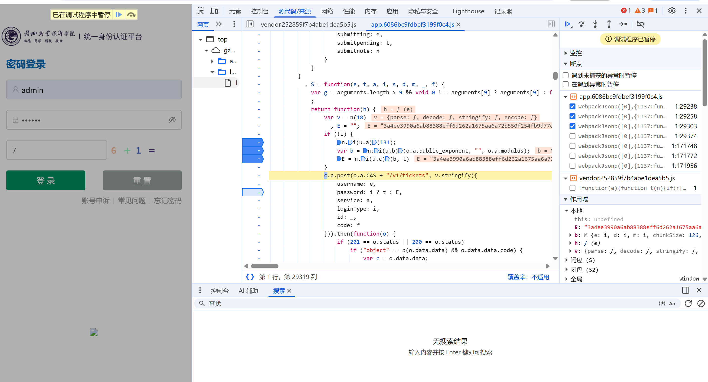
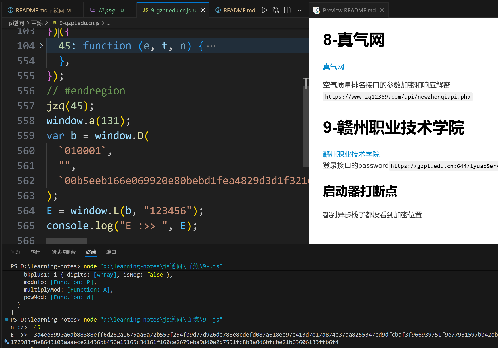
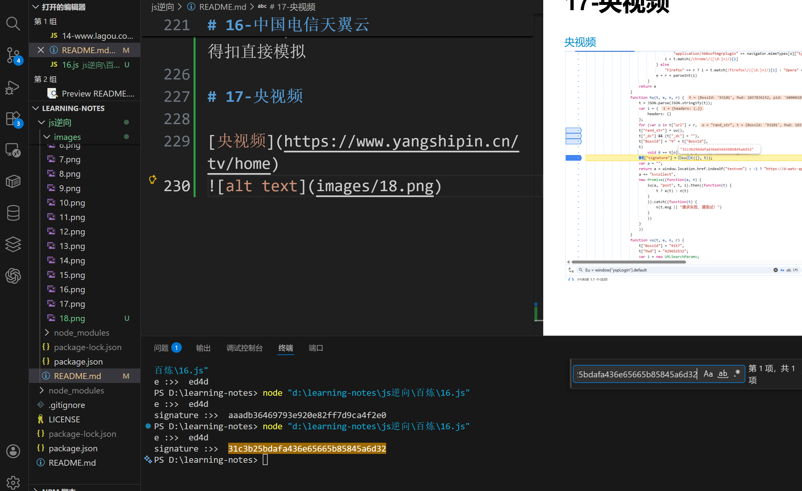

# 1-马蜂窝

[马蜂窝](https://www.mafengwo.cn/hotel/38322.html?iMddid=10206)
评论接口
`
https://www.mafengwo.cn/hotel/info/comment_list`

## debugger反调试

f12发现有debugger反调试，添加条件断点无效,采用注入过。

```
// 方法 1
_constructor = constructor;
Function.prototype.constructor = function(s){
 if (s === "debugger"){
 //console.log(s);
 return null;
 }
 return _constructor(s);
}
// 方法 2
Function.prototype.__constructor_back =
Function.prototype.constructor;
Function.prototype.constructor = function() {
 if(arguments && typeof arguments[0]==='string'){
 if("debugger" === arguments[0]){
 return
 }
 }
return
Function.prototype.__constructor_back.apply(this,arguments);
}
方法 3
Function.prototype.constructor = function (){}
```

## 打断点找加密位置


发现其在CA函数里完成参数`_sn`加密
单步调试进入，

加密传入的参数

```
{"_ts":"1768718004202","keyword_id":"0","page":"2","poi_id":"38322","type":"0"}c9d6618dbc657b41a66eb0af952906f1
```

结果

```
a095c2cdd170a50420ba510df028c426
```

验证结果为md5

结果不会了，有JS 探针校验（probe.js）。


# 2-中国空气质量在线监测分析平台

[中国空气质量在线监测分析平台](https://www.aqistudy.cn/)

天气数据接口 `
https://www.aqistudy.cn/apinew/aqistudyapi.php`

## 过反调试

1. 右键和f12禁用，从设置打开devtools
2. 无限debugger,一律不再此处暂停
3. 它还检测页面尺寸，把devtools停靠侧拿出来。

## 加密参数

1. 发现请求和响应都是密文
   
   请求参数搜不到。
2. 调用堆栈找
   
3. 请求参数解密
   
4. 解密响应参数
   hook `JSON.parse`

```
(function() {
var parse_ = JSON.parse;
JSON.parse = function(arg) {
console.log("您猜怎么着？断住了！ ——> ",arg);
debugger;
return parse_(arg); // 不改变原来的执行逻辑
 }})();
```


# 3-广东省公共资源交易平台

[广东省公共资源交易平台](https://ygp.gdzwfw.gov.cn/#/44/jygg)

items接口`https://ygp.gdzwfw.gov.cn/ggzy-portal/search/v2/items`

加密参数在header里

加密位置

D1直接进去，

qf直接扣，ef先看是不是标准算法，是sha256

# 4-汕头招聘网*汕头人才网*求职找工作认准百城招聘【马头商标】

[汕头招聘网](https://st.bczp.cn/login/jwlogin.aspx)

登录接口`
https://st.bczp.cn/ajax/login/jwlogin.ashx?r=0.09294470188368542`

直接搜account
另外publicKey在html里

# 5-企查查 - 查企业*查老板*查风险\_企业信息查询系统

[企查查](https://www.qcc.com/)
商业快讯接口`
https://www.qcc.com/api/home/getNewsFlash?firstRankIndex=&lastRankIndex=1769258487764&lastRankTime=1769258487764&pageSize=10`

容易走神整错

# 6-五百丁，个人简历，简历模板，个人简历模板

[五百丁](https://www.500d.me/)
登录接口`https://www.500d.me/login/submit/`
扣代码太麻烦了，因为没有账号，最后好像还没整对

# 7-登录—管家婆网店ERP

[管家婆网店ERP](https://login.wsgjp.com.cn/)
登录`https://passport.wsgjp.com.cn/erp/login`

# 8-真气网

[真气网](https://www.zq12369.com/environment.php?month=2023-12&tab=rank&order=DESC&type=MONTH)

空气质量排名接口的参数加密和响应解密
`https://www.zq12369.com/api/newzhenqiapi.php`

# 9-赣州职业技术学院

[赣州职业技术学院](https://gzpt.edu.cn:644/lyuapServer/login)
登录接口的password`https://gzpt.edu.cn:644/lyuapServer/v1/tickets`

## 启动器打断点

都到异步栈了都没看到加密位置

## 找到加密位置



## 发现这几个方法是webpack

这几个方法都在45里面，并且两个参数是写死的

## 发现n是加载器

加载器扣出来，调用45,把对应方法导出来替换。



其实我现在还是不太会整这个webpack，不懂

# 10-雷蛇登录

[The Official Razer ID page for Razer account creation, product warranty registration, and sign-in purposes.](https://razerid.razer.com/)

登录接口的password加密部分

也没验证对不对，光看扣下来的代码结果位数一样？

# 11-湖南师范大学继续教育学院

[湖南师范大学继续教育学院](https://hunnucj.jxjy.chaoxing.com/login)

搜关键字直接扣

# 12-大风车

[大风车](https://xindafengche.souche.com/#/login?action=accountLogin)

e,如果扣完发现不对(比如try,catch走了catch，小心调用方法的对象，别扣进去了)


比如这个le

# 13-多多买菜

[多多买菜](https://mdkd.pinduoduo.com/login)
登录接口的password

如果发现异步栈很难找，可以尝试尝试搜关键字excrypt之类的。

# 14-拉勾网

[拉勾网](https://www.lagou.com/wn/jobs)
接口`https://www.lagou.com/jobs/v2/positionAjax.json`

这个接口看起来挺好玩的，但是我现在不会滑块，留给以后做完。。。

# 15 - 财联社

[财联社](https://www.cls.cn/depth?id=1000)
接口`
 https://www.cls.cn/v3/depth/list/1000?app=CailianpressWeb&id=1000&last_time=1770380555&os=web&rn=20&sv=8.4.6&sign=99a466c9961f9fe902c129465993883b`
第一次不一样，没有last_time参数。
url稍微一变就不行了，，，
返回数据应该是全的吧，没细看

# 16-中国电信天翼云

[中国电信天翼云](https://www.ctyun.cn/h5/auth/login)
登录的password。
打包后的代码看不懂，cv给gpt，得到正确答案。webpack + des的ecb模式无iv。懒得扣直接模拟

# 17-央视频

[央视频](https://www.yangshipin.cn/tv/home)


至少signature的算法是对的，:)
c-key我补环境了，但是还不对。。。可能少什么东西了，位数不够

# 18-混沌书苑-用户登录

[混沌书苑-用户登录](https://www.chaoslib.com/user/login/?next=/)

登录接口的password，反调试用hook过，rsa加混淆。其中的时间戳参数是根据上面的服务器响应数据给的。

# 19-好看视频

[好看视频](https://haokan.baidu.com/)
你请求静态页面加正则拿到的是：`JSON 里的字符串字面量内容`
所以你拿到的是：
`\/`
而不是：
`/`

阴死我了
