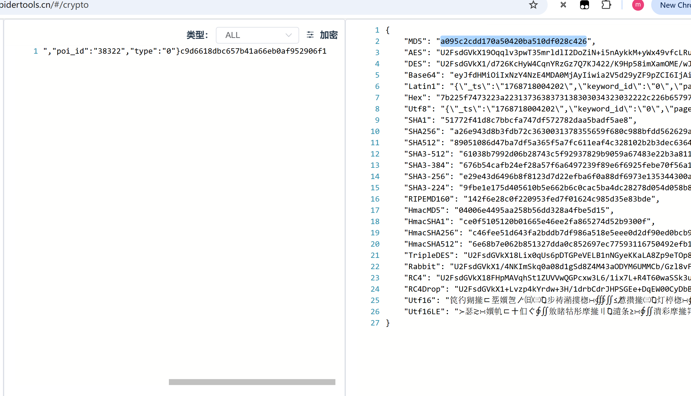
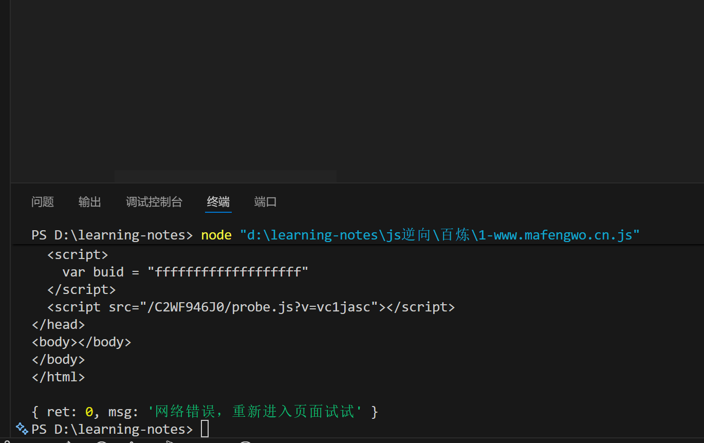
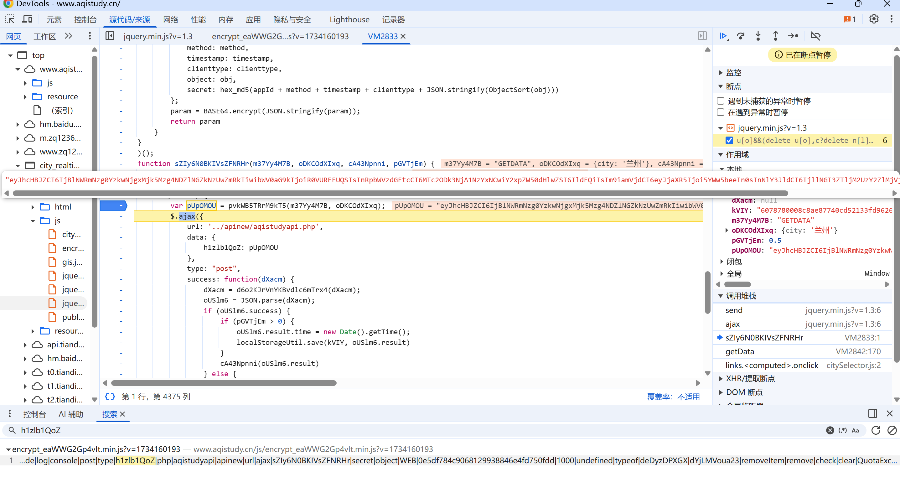
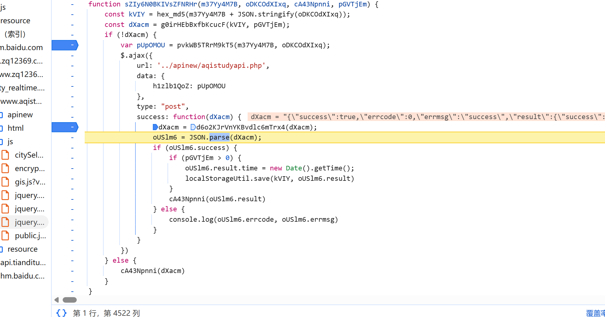

# 马蜂窝

[马蜂窝](https://www.mafengwo.cn/hotel/38322.html?iMddid=10206)
评论接口
`
https://www.mafengwo.cn/hotel/info/comment_list`

## debugger反调试

f12发现有debugger反调试，添加条件断点无效,采用注入过。

```
// 方法 1
_constructor = constructor;
Function.prototype.constructor = function(s){
 if (s === "debugger"){
 //console.log(s);
 return null;
 }
 return _constructor(s);
}
// 方法 2
Function.prototype.__constructor_back =
Function.prototype.constructor;
Function.prototype.constructor = function() {
 if(arguments && typeof arguments[0]==='string'){
 if("debugger" === arguments[0]){
 return
 }
 }
return
Function.prototype.__constructor_back.apply(this,arguments);
}
方法 3
Function.prototype.constructor = function (){}
```

## 打断点找加密位置


发现其在CA函数里完成参数`_sn`加密
单步调试进入，

加密传入的参数

```
{"_ts":"1768718004202","keyword_id":"0","page":"2","poi_id":"38322","type":"0"}c9d6618dbc657b41a66eb0af952906f1
```

结果

```
a095c2cdd170a50420ba510df028c426
```

验证结果为md5

结果不会了，有JS 探针校验（probe.js）。


# 中国空气质量在线监测分析平台

[中国空气质量在线监测分析平台](https://www.aqistudy.cn/)

天气数据接口 `
https://www.aqistudy.cn/apinew/aqistudyapi.php`

## 过反调试

1. 右键和f12禁用，从设置打开devtools
2. 无限debugger,一律不再此处暂停
3. 它还检测页面尺寸，把devtools停靠侧拿出来。

## 加密参数

1. 发现请求和响应都是密文
   
   请求参数搜不到。
2. 调用堆栈找
   
3. 请求参数解密
   
4. 解密响应参数
   hook `JSON.parse`

```
(function() {
var parse_ = JSON.parse;
JSON.parse = function(arg) {
console.log("您猜怎么着？断住了！ ——> ",arg);
debugger;
return parse_(arg); // 不改变原来的执行逻辑
 }})();
```



# 广东省公共资源交易平台

[广东省公共资源交易平台](https://ygp.gdzwfw.gov.cn/#/44/jygg)

items接口`https://ygp.gdzwfw.gov.cn/ggzy-portal/search/v2/items`

加密参数在header里

加密位置

D1直接进去，

qf直接扣，ef先看是不是标准算法，是sha256
